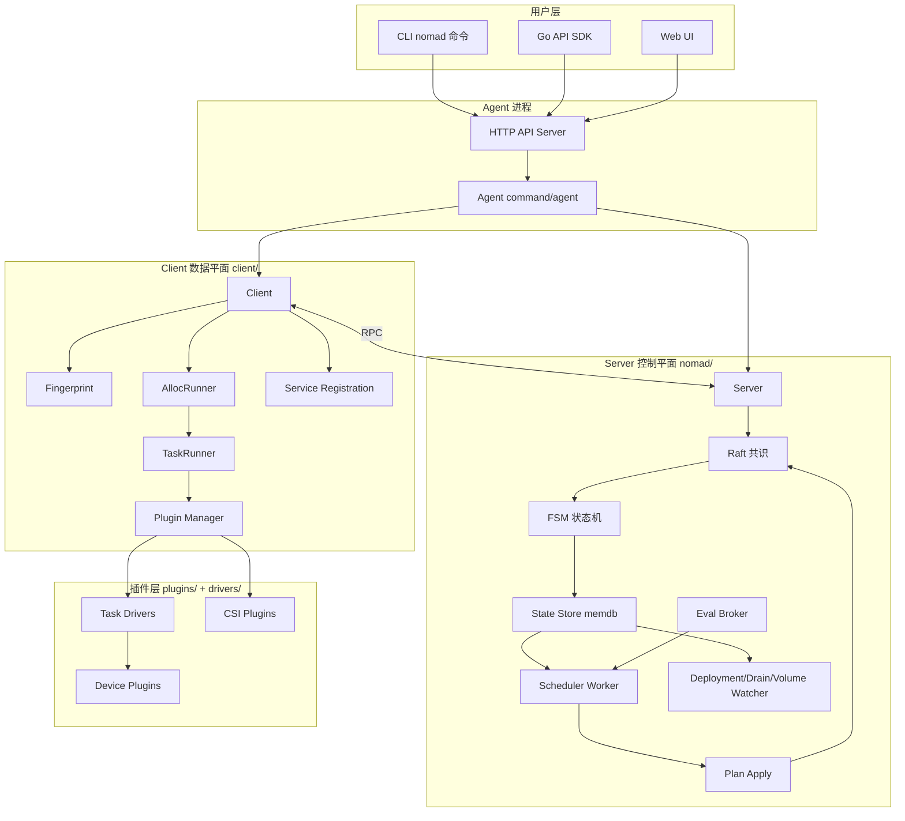
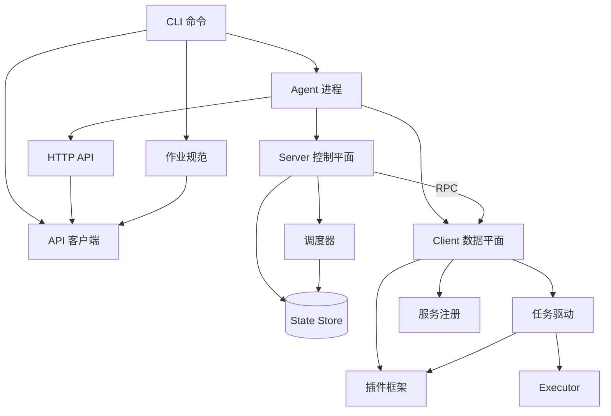
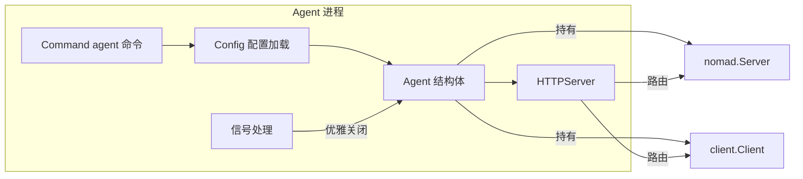
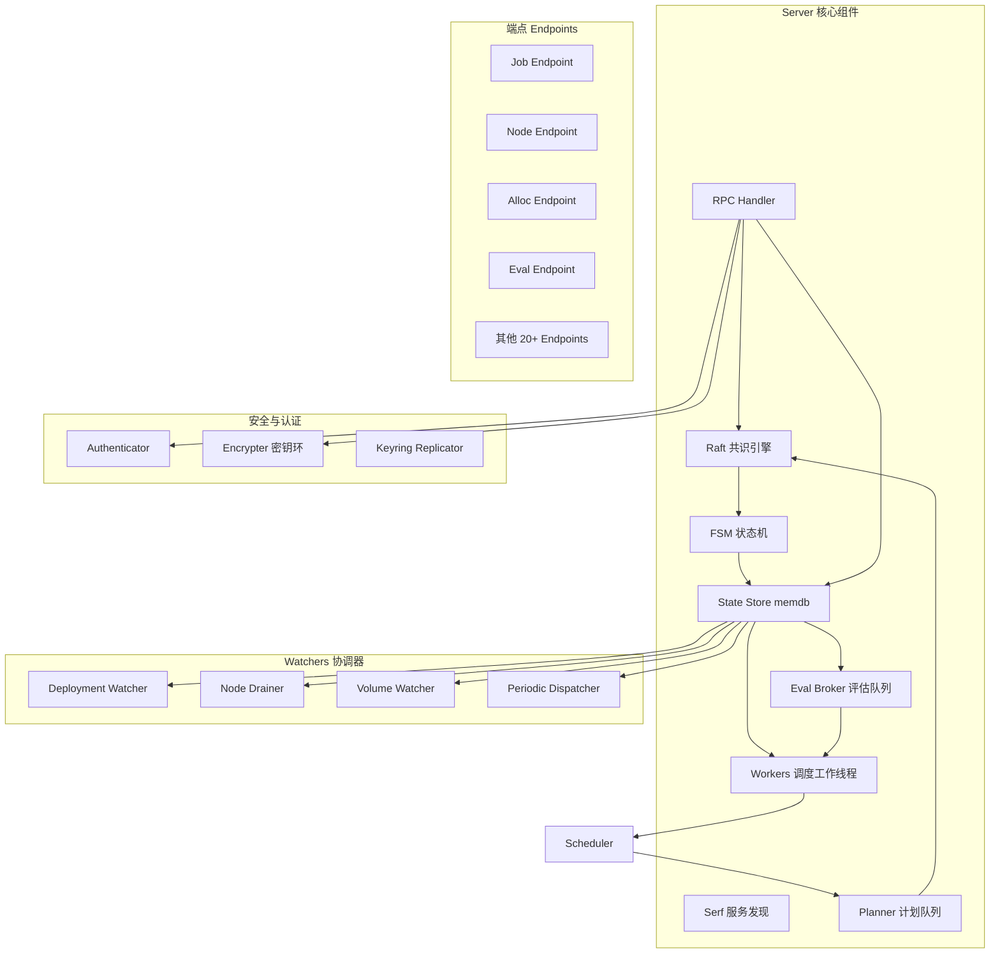
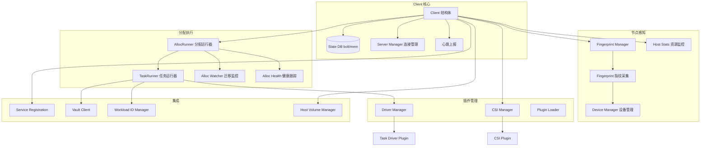
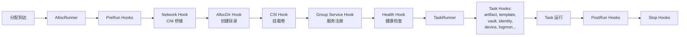
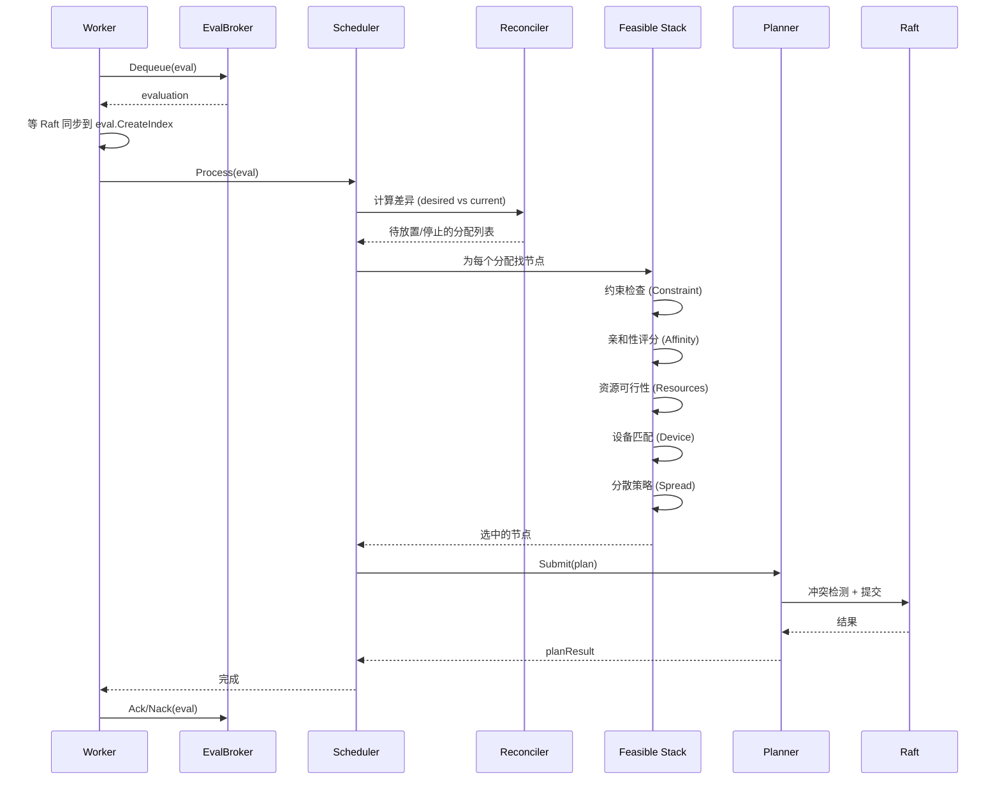
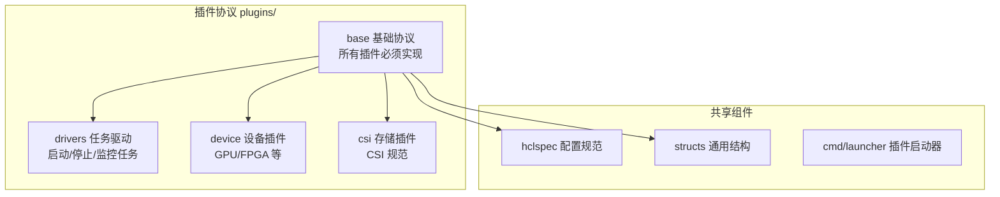
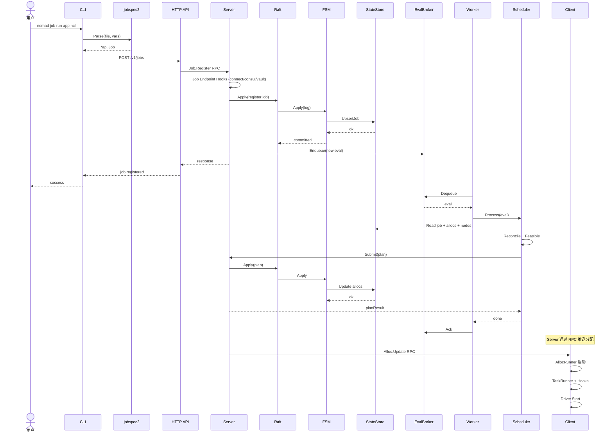

# Nomad 技术架构分析

> 本文档基于 Nomad 源码（`github.com/hashicorp/nomad`，Go 1.26）分析其技术实现，梳理子系统划分、模块职责及相互关系。

---

## 目录

1. [项目定位与架构哲学](#1-项目定位与架构哲学)
2. [顶层架构总览](#2-顶层架构总览)
3. [子系统划分](#3-子系统划分)
4. [CLI 命令子系统](#4-cli-命令子系统)
5. [Agent 进程子系统](#5-agent-进程子系统)
6. [Server 子系统（控制平面）](#6-server-子系统控制平面)
7. [Client 子系统（数据平面）](#7-client-子系统数据平面)
8. [调度器子系统](#8-调度器子系统)
9. [插件子系统](#9-插件子系统)
10. [任务驱动实现](#10-任务驱动实现)
11. [HCL 作业规范与 API 客户端](#11-hcl-作业规范与-api-客户端)
12. [辅助工具库](#12-辅助工具库)
13. [跨子系统数据流](#13-跨子系统数据流)
14. [模块关系矩阵](#14-模块关系矩阵)
15. [关键技术选型](#15-关键技术选型)

---

## 1. 项目定位与架构哲学

Nomad 是 HashiCorp 出品的**工作负载编排器**（Workload Orchestrator），用于部署和管理容器化与非容器化应用，跨越数据中心与云环境。

### 设计哲学

| 原则 | 体现 |
|---|---|
| **Server-Client 分离** | 控制平面（Server）与数据平面（Client）解耦，可独立扩展 |
| **Raft 强一致性** | 所有状态变更经 Raft 共识，牺牲延迟换一致 |
| **乐观并发调度** | Scheduler 基于快照决策，Plan Apply 阶段冲突检测 |
| **插件化驱动** | 任务驱动、设备、CSI 均为 gRPC 插件，进程隔离 |
| **声明式作业规范** | HCL 描述期望状态，系统收敛至该状态 |
| **Hook 链式扩展** | AllocRunner/TaskRunner 用 Hook 机制组装横切关注点 |

### 与同类项目差异

- **vs Kubernetes**：Nomad 单二进制部署，架构简单；K8s 多组件（apiserver/etcd/scheduler/kubelet）分布式
- **vs Mesos**：Nomad 内置调度器，Mesos 仅提供调度框架需自实现调度器
- **vs Swarm**：Nomad 支持非容器化任务（exec/java/qemu），Swarm 仅容器

---

## 2. 顶层架构总览



### 核心架构层次

```
┌─────────────────────────────────────────┐
│  用户接入层：CLI / HTTP API / Go SDK    │
├─────────────────────────────────────────┤
│  Agent 进程层：统一进程入口与 HTTP 服务  │
├─────────────────────────────────────────┤
│  Server 控制平面：共识/状态/调度/协调   │
├─────────────────────────────────────────┤
│  Client 数据平面：执行/指纹/服务注册    │
├─────────────────────────────────────────┤
│  调度器层：可行性检查/协调/计划生成     │
├─────────────────────────────────────────┤
│  插件层：任务驱动/设备/CSI（gRPC 进程）  │
├─────────────────────────────────────────┤
│  基础库：Raft/Serf/memdb/HCL/TLS        │
└─────────────────────────────────────────┘
```

---

## 3. 子系统划分

基于源码目录与职责边界，Nomad 划分为 **10 个子系统**：

| # | 子系统 | 源码位置 | 职责 | 角色 |
|---|---|---|---|---|
| 1 | CLI 命令 | `main.go`, `command/` | 命令行交互入口 | 用户接入 |
| 2 | Agent 进程 | `command/agent/` | 统一进程、HTTP 服务、配置 | 运行时容器 |
| 3 | Server 控制平面 | `nomad/` | 共识、状态、调度协调、RPC | 大脑 |
| 4 | Client 数据平面 | `client/` | 任务执行、节点管理 | 手脚 |
| 5 | 调度器 | `scheduler/` | 放置决策算法 | 决策引擎 |
| 6 | 插件框架 | `plugins/` | 插件协议与 gRPC 通信 | 扩展机制 |
| 7 | 任务驱动 | `drivers/` | 具体驱动实现 | 执行器 |
| 8 | 作业规范 | `jobspec2/` | HCL 解析 | 配置语言 |
| 9 | API 客户端 | `api/` | Go SDK | 编程接入 |
| 10 | 辅助库 | `helper/`, `lib/`, `acl/` | 通用工具 | 基础设施 |

### 子系统依赖关系



---

## 4. CLI 命令子系统

### 4.1 入口

**源码**：[`main.go`](file:///d:/claude/nomad/main.go)

```go
func main() {
    os.Exit(Run(os.Args[1:]))
}
```

`Run()` 通过 `command.Commands()` 获取命令注册表，交由 `hashicorp/cli` 库分发。

### 4.2 命令注册

**源码**：[`command/commands.go`](file:///d:/claude/nomad/command/commands.go)

所有 CLI 子命令在此注册，按功能域分组：

| 命令组 | 主要命令 | 职责 |
|---|---|---|
| 作业管理 | `job run/stop/status/plan/validate` | 作业生命周期 |
| 分配管理 | `alloc status/logs/fs/exec/restart` | 分配操作 |
| 节点管理 | `node status/drain/eligibility` | 节点运维 |
| 评估管理 | `eval list/status/delete` | 调度评估 |
| 部署管理 | `deployment status/promote/fail` | 部署推进 |
| ACL | `acl bootstrap/policy/token` | 访问控制 |
| 变量 | `var get/put/list/lock` | 变量管理 |
| 卷 | `volume create/delete/status` | 存储卷 |
| Operator | `operator raft/api/debug` | 运维操作 |
| Agent | `agent` | 启动 Agent 进程 |

### 4.3 关键设计

- **早期导入特殊命令**：`main.go` 顶部 `_ import` 了 `getter`、`template renderer`、`logmon`、`docker_logger`、`executor`，这些命令检测 `os.Args` 后直接进入自身逻辑，作为独立子进程运行（避免加载全部代码占用内存）
- **Meta 共享**：`command.Meta` 封装 API 客户端、UI、配置，被各命令复用
- **JobGetter**：[`command/helpers.go`](file:///d:/claude/nomad/command/helpers.go) 统一作业文件获取（本地/远程 URL/stdin），调用 `jobspec2` 解析

---

## 5. Agent 进程子系统

### 5.1 职责

**源码**：[`command/agent/`](file:///d:/claude/nomad/command/agent/)

Agent 是 Nomad 的**运行时容器**，一个进程可同时承载 Server 和 Client 角色（dev 模式），或仅其一（生产部署）。

### 5.2 核心组件



| 文件 | 职责 |
|---|---|
| [`command.go`](file:///d:/claude/nomad/command/agent/command.go) | `nomad agent` 命令实现，解析参数、启动 Agent |
| [`agent.go`](file:///d:/claude/nomad/command/agent/agent.go) | `Agent` 结构体，持有 Server 与 Client |
| [`http.go`](file:///d:/claude/nomad/command/agent/http.go) | HTTP API 服务器，路由到 Server/Client RPC |
| [`config.go`](file:///d:/claude/nomad/command/agent/config.go) | HCL/JSON 配置文件解析与合并 |
| [`plugins.go`](file:///d:/claude/nomad/command/agent/plugins.go) | 内置插件注册 |
| [`consul/`](file:///d:/claude/nomad/command/agent/consul/) | Consul 集成（服务注册、配置条目） |

### 5.3 HTTP API 路由

`HTTPServer` 将 HTTP 请求转换为对 Server 或 Client 的 RPC 调用：

- `/v1/jobs`, `/v1/nodes`, `/v1/allocations` → Server RPC
- `/v1/client/*`, `/v1/agent/*` → Client RPC
- `/v1/operator/*` → Server 管理 RPC

---

## 6. Server 子系统（控制平面）

### 6.1 定位

**源码**：[`nomad/`](file:///d:/claude/nomad/nomad/)

Server 是 Nomad 的**大脑**，负责：
- 维护集群状态（经 Raft 共识）
- 接收作业提交，生成评估
- 调度决策（Worker + Scheduler）
- 协调部署、节点排水、卷释放
- 跨区域联邦

### 6.2 Server 核心结构

**源码**：[`nomad/server.go`](file:///d:/claude/nomad/nomad/server.go) - `Server` 结构体



### 6.3 核心子模块

#### 6.3.1 Raft 共识与 FSM

| 文件 | 职责 |
|---|---|
| [`server.go`](file:///d:/claude/nomad/nomad/server.go) | Server 结构体，初始化 Raft、Serf、各组件 |
| [`fsm.go`](file:///d:/claude/nomad/nomad/fsm.go) | 有限状态机，应用 Raft 日志到 StateStore |
| [`raft_rpc.go`](file:///d:/claude/nomad/nomad/raft_rpc.go) | Raft 传输层 |
| [`leader.go`](file:///d:/claude/nomad/nomad/leader.go) | Leader 选举后的领导逻辑（启动 watchers、reconcile） |
| [`serf.go`](file:///d:/claude/nomad/nomad/serf.go) | Serf gossip（Server 间成员发现） |

**FSM 快照类型**（`fsm.go` 顶部 `SnapshotType` 常量）：涵盖 Node、Job、Eval、Alloc、Deployment、ACL、CSI、Variables、HostVolume 等 30+ 类型。

**Raft 后端**：支持 `raft-boltdb`（默认）和 `raft-wal`（高性能，可选）。

#### 6.3.2 状态存储

**源码**：[`nomad/state/`](file:///d:/claude/nomad/nomad/state/)

基于 `go-memdb` 的内存数据库，事务化访问。

| 表 | 说明 |
|---|---|
| `nodes` | 节点注册信息 |
| `node_pools` | 节点池 |
| `jobs` | 作业定义 |
| `allocs` | 分配实例 |
| `evals` | 评估 |
| `deployments` | 部署 |
| `csi_volumes` / `csi_plugins` | CSI 存储 |
| `host_volumes` | 主机卷 |
| `variables` | 变量（KV 存储） |
| `service_registrations` | 服务注册 |
| `acl_*` | ACL 策略/令牌/角色/方法 |
| `root_keys` | 加密根密钥 |

辅助子包：
- [`indexer/`](file:///d:/claude/nomad/nomad/state/indexer/) - 自定义索引器（UUID、时间等）
- [`paginator/`](file:///d:/claude/nomad/nomad/state/paginator/) - 分页与过滤
- [`stream/`](file:///d:/claude/nomad/nomad/stream/) - 事件流（变更通知）

#### 6.3.3 评估代理（Eval Broker）

**源码**：[`nomad/eval_broker.go`](file:///d:/claude/nomad/nomad/eval_broker.go)

内存中的优先级队列，管理待处理评估。

**特性**：
- 按 `scheduler type`（service/batch/system）分队列
- 按优先级排序
- **按 Job 序列化**：同一 Job 的评估串行处理
- At-least-once 投递：Ack/Nack 机制，Nack 超时重投
- Delivery limit：达上限移入 `_failed` 队列

#### 6.3.4 调度 Worker

**源码**：[`nomad/worker.go`](file:///d:/claude/nomad/nomad/worker.go)

Worker 是调度循环的执行单元：
1. 从 EvalBroker **Dequeue** 评估
2. 等待 Raft 同步到评估的索引
3. 实例化对应 Scheduler
4. 调用 `Scheduler.Process(eval)`
5. 根据结果 Ack/Nack 评估

#### 6.3.5 计划应用（Plan Apply）

**源码**：[`nomad/plan_apply.go`](file:///d:/claude/nomad/nomad/plan_apply.go), [`plan_queue.go`](file:///d:/claude/nomad/nomad/plan_queue.go)

Scheduler 生成 `Plan`（期望的分配变更），提交给 Leader 的 PlanQueue：
1. Leader 从 PlanQueue 取出 Plan
2. **冲突检测**：检查快照后是否有并发变更
3. 无冲突 → 提交 Raft 日志
4. 有冲突 → 拒绝，Scheduler 重新调度
5. `BadNodeTracker`：追踪频繁被拒的节点，标记为 ineligible

#### 6.3.6 阻塞评估（Blocked Evals）

**源码**：[`nomad/blocked_evals.go`](file:///d:/claude/nomad/nomad/blocked_evals.go)

资源不足时评估被阻塞，等待容量变更（节点加入、分配停止）后重新入队。

#### 6.3.7 RPC 端点

Server 暴露 20+ RPC 端点，每个端点对应一类资源：

| 端点文件 | 资源 |
|---|---|
| `job_endpoint.go` | 作业（含 8 个 hook：connect、consul、vault、numa 等） |
| `node_endpoint.go` | 节点 |
| `alloc_endpoint.go` | 分配 |
| `eval_endpoint.go` | 评估 |
| `deployment_endpoint.go` | 部署 |
| `csi_endpoint.go` | CSI 卷与插件 |
| `host_volume_endpoint.go` | 主机卷 |
| `acl_endpoint.go` | ACL |
| `variables_endpoint.go` | 变量 |
| `node_pool_endpoint.go` | 节点池 |
| `namespace_endpoint.go` | 命名空间 |
| `service_registration_endpoint.go` | 服务注册 |
| `operator_endpoint.go` | 运维操作 |
| `scaling_endpoint.go` | 自动伸缩 |
| `periodic_endpoint.go` | 周期作业 |
| `search_endpoint.go` | 搜索 |
| `regions_endpoint.go` | 跨区域联邦 |
| `client_*_endpoint.go` | Client 代理端点（Server 转发到 Client） |
| `event_endpoint.go` | 事件流 |
| `keyring_endpoint.go` | 密钥环 |
| `status_endpoint.go` | 集群状态 |
| `system_endpoint.go` | 系统垃圾回收 |

**Job Endpoint Hook 机制**：作业提交经过链式 Hook 处理（[`job_endpoint_hooks.go`](file:///d:/claude/nomad/nomad/job_endpoint_hooks.go)），每个 Hook 增强作业（如自动注入 Connect sidecar、服务身份、Vault 策略）。

#### 6.3.8 协调器（Watchers）

| 组件 | 源码 | 职责 |
|---|---|---|
| Deployment Watcher | [`nomad/deploymentwatcher/`](file:///d:/claude/nomad/nomad/deploymentwatcher/) | 监控部署进度，推进 canary/rolling update |
| Node Drainer | [`nomad/drainer/`](file:///d:/claude/nomad/nomad/drainer/) | 节点排水，迁移分配 |
| Volume Watcher | [`nomad/volumewatcher/`](file:///d:/claude/nomad/nomad/volumewatcher/) | 释放卷声明 |
| Periodic Dispatcher | [`nomad/periodic.go`](file:///d:/claude/nomad/nomad/periodic.go) | 周期作业触发 |
| Encrypter | [`nomad/encrypter.go`](file:///d:/claude/nomad/nomad/encrypter.go) | 变量加密、工作负载身份签名 |
| Heartbeater | [`nomad/heartbeat.go`](file:///d:/claude/nomad/nomad/heartbeat.go) | 节点心跳与下线检测 |
| Event Broker | [`nomad/stream/`](file:///d:/claude/nomad/nomad/stream/) | 事件流发布订阅 |
| Locks | [`nomad/lock/`](file:///d:/claude/nomad/nomad/lock/) | 变量锁（TTL + Delay） |

---

## 7. Client 子系统（数据平面）

### 7.1 定位

**源码**：[`client/`](file:///d:/claude/nomad/client/)

Client 是 Nomad 的**手脚**，运行在每个工作节点上，负责：
- 注册节点并上报指纹
- 接收分配并执行任务
- 管理任务生命周期
- 服务注册与健康检查
- 与 Server 保持心跳

### 7.2 Client 核心结构

**源码**：[`client/client.go`](file:///d:/claude/nomad/client/client.go) - `Client` 结构体



### 7.3 核心子模块

#### 7.3.1 指纹采集（Fingerprint）

**源码**：[`client/fingerprint/`](file:///d:/claude/nomad/client/fingerprint/)

探测节点硬件与环境属性，上报给 Server 用于调度决策。

| 探测器 | 探测内容 |
|---|---|
| `cpu.go` | CPU 架构、核数、频率、NUMA 拓扑 |
| `memory.go` | 内存容量 |
| `storage.go` | 磁盘 |
| `network.go` | 网络接口 |
| `arch.go` | CPU 架构 |
| `host.go` | 操作系统、内核 |
| `consul.go` | Consul agent |
| `vault.go` | Vault agent |
| `cni.go` | CNI 插件 |
| `env_aws/azure/gce.go` | 云元数据 |
| `dynamic_host_volumes.go` | 动态主机卷 |
| `secrets.go` | 密钥后端 |
| `landlock.go` | Linux Landlock |

#### 7.3.2 分配运行器（AllocRunner）

**源码**：[`client/allocrunner/`](file:///d:/claude/nomad/client/allocrunner/)

管理单个分配（Allocation）的完整生命周期，采用 **Hook 链**机制组装各阶段逻辑。



**AllocRunner Hooks**（[`alloc_runner_hooks.go`](file:///d:/claude/nomad/client/allocrunner/alloc_runner_hooks.go)）：

| Hook | 职责 |
|---|---|
| `network_hook` | 网络命名空间创建（CNI） |
| `allocdir_hook` | 分配目录结构 |
| `csi_hook` | CSI 卷挂载 |
| `group_service_hook` | 组级服务注册 |
| `health_hook` | 分配健康状态 |
| `identity_hook` | 工作负载身份令牌 |
| `migrate_hook` | 数据迁移 |
| `max_run_duration_hook` | 运行时长限制 |
| `upstream_allocs_hook` | 上游分配依赖 |
| `cpuparts_hook` | CPU 分区 |

#### 7.3.3 任务运行器（TaskRunner）

**源码**：[`client/allocrunner/taskrunner/`](file:///d:/claude/nomad/client/allocrunner/taskrunner/)

管理单个任务的生命周期，Hook 数量更多（20+）：

| Hook | 源码 | 职责 |
|---|---|---|
| `artifact_hook` | `artifact_hook.go` | 下载制品 |
| `template_hook` | `template_hook.go` | consul-template 渲染 |
| `vault_hook` | `vault_hook.go` | Vault 令牌获取与续约 |
| `identity_hook` | `identity_hook.go` | 工作负载身份 |
| `device_hook` | `device_hook.go` | 设备挂载 |
| `logmon_hook` | `logmon_hook.go` | 日志收集 |
| `service_hook` | `service_hook.go` | 任务级服务注册 |
| `envoy_bootstrap_hook` | `envoy_bootstrap_hook.go` | Envoy 配置生成 |
| `connect_native_hook` | `connect_native_hook.go` | Connect 原生集成 |
| `consul_hook` | `consul_hook.go` | Consul socket 代理 |
| `script_check_hook` | `script_check_hook.go` | 脚本健康检查 |
| `volume_hook` | `volume_hook.go` | 卷挂载 |
| `dispatch_hook` | `dispatch_hook.go` | 派遣负载 |
| `api_hook` | `api_hook.go` | API 任务类型 |
| `sched_hook` | `sched_hook.go` | 任务调度策略 |
| `secrets_hook` | `secrets_hook.go` | 密钥管理 |
| `validate_hook` | `validate_hook.go` | 启动前校验 |
| `stats_hook` | `stats_hook.go` | 资源统计 |
| `task_dir_hook` | `task_dir_hook.go` | 任务目录 |
| `dynamic_users_hook` | `dynamic_users_hook.go` | 动态用户创建 |

**TaskLifecycle 协调器**（[`tasklifecycle/`](file:///d:/claude/nomad/client/allocrunner/taskrunner/tasklifecycle/)）：用 gate 机制协调任务启动顺序（依赖、迁移完成等）。

#### 7.3.4 插件管理

**源码**：[`client/pluginmanager/`](file:///d:/claude/nomad/client/pluginmanager/)

| Manager | 职责 |
|---|---|
| `drivermanager/` | 任务驱动插件发现、加载、指纹 |
| `csimanager/` | CSI 插件管理、卷操作、用量追踪 |

插件以独立进程运行，通过 hashicorp/go-plugin（gRPC）通信。

#### 7.3.5 服务注册

**源码**：[`client/serviceregistration/`](file:///d:/claude/nomad/client/serviceregistration/)

| Provider | 说明 |
|---|---|
| `nsd/` | Nomad 原生服务发现（Nomad Service Discovery） |
| `wrapper/` | 包装层，根据作业配置路由到 Nomad 或 Consul |
| `checks/` | 健康检查管理 |

#### 7.3.6 其他子模块

| 模块 | 源码 | 职责 |
|---|---|---|
| `allocdir/` | `client/allocdir/` | 分配目录结构（local/secrets/task） |
| `allocwatcher/` | `client/allocwatcher/` | 分配迁移监控 |
| `allochealth/` | `client/allochealth/` | 分配健康状态跟踪 |
| `hoststats/` | `client/hoststats/` | 主机资源统计 |
| `hostvolumemanager/` | `client/hostvolumemanager/` | 主机卷生命周期 |
| `widmgr/` | `client/widmgr/` | 工作负载身份管理 |
| `taskenv/` | `client/taskenv/` | 任务环境变量生成 |
| `state/` | `client/state/` | 客户端本地状态（BoltDB） |
| `servers/` | `client/servers/` | Server 连接列表管理 |
| `dynamicplugins/` | `client/dynamicplugins/` | 动态插件注册 |
| `config/` | `client/config/` | Client 配置 |

---

## 8. 调度器子系统

### 8.1 定位

**源码**：[`scheduler/`](file:///d:/claude/nomad/scheduler/)

调度器是 Nomad 的**决策引擎**，计算"在哪里运行什么"。它作为库被 Server 的 Worker 调用。

### 8.2 调度器类型

**源码**：[`scheduler/scheduler.go`](file:///d:/claude/nomad/scheduler/scheduler.go)

```go
var BuiltinSchedulers = map[string]structs.Factory{
    "service":   NewServiceScheduler,   // 长期运行服务
    "batch":     NewBatchScheduler,     // 批处理任务
    "system":    NewSystemScheduler,    // 每节点运行
    "sysbatch":  NewSysBatchScheduler,  // 每节点批处理
}
```

| 调度器 | 适用场景 | 特点 |
|---|---|---|
| Service | 长期服务 | 高质量放置，支持滚动更新、canary |
| Batch | 批处理 | 快速决策，允许低质量放置 |
| System | 守护进程 | 每个合格节点运行一个实例 |
| SysBatch | 一次性系统任务 | 每节点运行一次 |

### 8.3 调度流程



### 8.4 核心子模块

#### 8.4.1 协调器（Reconciler）

**源码**：[`scheduler/reconciler/`](file:///d:/claude/nomad/scheduler/reconciler/)

计算**期望状态**（Job 定义）与**当前状态**（已有分配）的差异，输出需要：
- 新增的分配（place）
- 停止的分配（stop）
- 原地更新的分配（inplace update）
- 忽略的分配（ignore）

分两个维度：
- `reconcile_cluster.go`：集群级（Job 变更触发的全局协调）
- `reconcile_node.go`：节点级（节点上下线触发的局部协调）

#### 8.4.2 可行性栈（Feasible Stack）

**源码**：[`scheduler/feasible/`](file:///d:/claude/nomad/scheduler/feasible/)

管道式过滤+评分，从所有节点中选出最佳放置：

| 阶段 | 源码 | 职责 |
|---|---|---|
| Constraint | `feasible.go` | 硬性约束过滤 |
| Affinity | `rank.go` | 软性偏好评分 |
| Resources | `feasible.go` | 资源需求检查 |
| Device | `device.go` | 设备可用性 |
| Spread | `spread.go` | 分散策略评分 |
| Preemption | `preemption.go` | 抢占低优先级分配 |
| Select | `select.go` | 最终选择 |
| Stack | `stack.go` | 组装上述阶段 |

#### 8.4.3 核心调度器（Core Scheduler）

**源码**：[`nomad/core_sched.go`](file:///d:/claude/nomad/nomad/core_sched.go)

特殊调度器，处理系统级任务：垃圾回收、周期评估触发等。

---

## 9. 插件子系统

### 9.1 定位

**源码**：[`plugins/`](file:///d:/claude/nomad/plugins/)

定义插件协议，基于 hashicorp/go-plugin（gRPC）实现进程隔离。

### 9.2 插件类型



| 子包 | 源码 | 职责 |
|---|---|---|
| `base/` | [`plugins/base/`](file:///d:/claude/nomad/plugins/base/) | 基础接口（PluginInfo、ConfigSchema） |
| `drivers/` | [`plugins/drivers/`](file:///d:/claude/nomad/plugins/drivers/) | 任务驱动接口（Fingerprint、Start、Stop、Stats、Exec） |
| `device/` | [`plugins/device/`](file:///d:/claude/nomad/plugins/device/) | 设备插件接口（Reserve、Stats） |
| `csi/` | [`plugins/csi/`](file:///d:/claude/nomad/plugins/csi/) | CSI 客户端（Controller + Node） |
| `shared/hclspec/` | [`plugins/shared/hclspec/`](file:///d:/claude/nomad/plugins/shared/hclspec/) | HCL 配置 Schema（protobuf） |
| `shared/structs/` | [`plugins/shared/structs/`](file:///d:/claude/nomad/plugins/shared/structs/) | 通用结构（Attribute、Stats） |

### 9.3 插件通信

```
Nomad Agent (主进程)
    │
    │ go-plugin (hashicorp/go-plugin)
    │ gRPC over Unix socket / TCP
    │
    ▼
插件子进程 (driver/device/csi)
```

插件作为独立进程运行，崩溃不影响 Agent。通过 protobuf 定义接口（`*.proto` 文件）。

---

## 10. 任务驱动实现

### 10.1 定位

**源码**：[`drivers/`](file:///d:/claude/nomad/drivers/)

实现 `plugins/drivers` 接口的具体驱动。

### 10.2 内置驱动

| 驱动 | 源码 | 隔离方式 | 适用场景 |
|---|---|---|---|
| Docker | [`drivers/docker/`](file:///d:/claude/nomad/drivers/docker/) | 容器 | 最常用，OCI 镜像 |
| Exec | [`drivers/exec/`](file:///d:/claude/nomad/drivers/exec/) | cgroup + chroot | 隔离二进制 |
| Raw Exec | [`drivers/rawexec/`](file:///d:/claude/nomad/drivers/rawexec/) | 无隔离（cgroup） | 信任环境 |
| Java | [`drivers/java/`](file:///d:/claude/nomad/drivers/java/) | JVM + cgroup | Java 应用 |
| QEMU | [`drivers/qemu/`](file:///d:/claude/nomad/drivers/qemu/) | 虚拟机 | 强隔离 |
| Mock | [`drivers/mock/`](file:///d:/claude/nomad/drivers/mock/) | 无 | 测试 |

### 10.3 共享执行器（Executor）

**源码**：[`drivers/shared/executor/`](file:///d:/claude/nomad/drivers/shared/executor/)

Exec 和 RawExec 驱动共享的执行引擎，负责：
- 进程启动与监控
- cgroup 管理（CPU、内存、设备限制）
- 命名空间隔离（PID、网络、挂载）
- 资源统计
- 信号处理
- PTY 支持

| 组件 | 职责 |
|---|---|
| `executor.go` | 核心执行器接口 |
| `executor_linux.go` | Linux cgroup v1/v2 实现 |
| `executor_windows.go` | Windows Job Object 实现 |
| `grpc_client.go` / `grpc_server.go` | gRPC 通信 |
| `procstats/` | 进程统计 |

### 10.4 Docker 驱动架构

Docker 驱动最复杂，包含：

| 文件 | 职责 |
|---|---|
| `driver.go` | 主驱动逻辑 |
| `coordinator.go` | 并发拉取协调 |
| `cpuset.go` | CPU 集合管理 |
| `network.go` | 网络配置 |
| `ports.go` | 端口映射 |
| `reconcile_dangling.go` | 悬挂容器清理 |
| `fingerprint.go` | Docker daemon 探测 |
| `docklog/` | Docker 日志驱动（独立插件） |

### 10.5 其他共享组件

| 组件 | 源码 | 职责 |
|---|---|---|
| `capabilities/` | `drivers/shared/capabilities/` | Linux capabilities 管理 |
| `eventer/` | `drivers/shared/eventer/` | 事件重试与去重 |
| `hostnames/` | `drivers/shared/hostnames/` | 主机名挂载 |
| `resolvconf/` | `drivers/shared/resolvconf/` | DNS 配置挂载 |
| `validators/` | `drivers/shared/validators/` | 配置校验 |

---

## 11. HCL 作业规范与 API 客户端

### 11.1 HCL 作业规范

**源码**：[`jobspec2/`](file:///d:/claude/nomad/jobspec2/)

基于 HCL v2 的领域特定语言，解析 `.nomad.hcl` 文件为 `api.Job`。

> 详细语法与函数请参考 [nomad_HCL.md](file:///d:/claude/nomad/nomad_HCL.md)。

**核心流程**：
```
HCL 源文件 → parseHCLOrJSON() → decodeBody() [变量/locals/job] → normalizeJob() → api.Job
```

**关键文件**：

| 文件 | 职责 |
|---|---|
| `parse.go` | 解析入口 |
| `types.config.go` | jobConfig、Schema、EvalContext |
| `types.variables.go` | 变量系统 |
| `functions.go` | 80+ 内置函数 |
| `hcl_conversions.go` | 自定义类型解码 |
| `hclutil/blockattrs.go` | Block-as-Attribute 转换 |

### 11.2 API 客户端库

**源码**：[`api/`](file:///d:/claude/nomad/api/)

Go SDK，封装 HTTP API 调用。

| 文件 | 资源 |
|---|---|
| `api.go` | Client 核心结构 |
| `jobs.go` | 作业 API |
| `allocations.go` | 分配 API |
| `nodes.go` | 节点 API |
| `deployments.go` | 部署 API |
| `csi.go` | CSI 卷 API |
| `host_volumes.go` | 主机卷 API |
| `variables.go` | 变量 API |
| `acl.go` | ACL API |
| `operator.go` | 运维 API |
| `event_stream.go` | 事件流 |
| `fs.go` | 文件系统 API |

API 包独立维护（`api/go.mod`），用户项目可单独引用。

---

## 12. 辅助工具库

### 12.1 helper 包

**源码**：[`helper/`](file:///d:/claude/nomad/helper/)

| 子包 | 职责 |
|---|---|
| `tlsutil/` | TLS 配置生成与包装 |
| `pool/` | 连接池（多路复用） |
| `raftutil/` | Raft 辅助（FSM、迁移） |
| `uuid/` | UUID 生成 |
| `logging/` | 日志配置 |
| `codec/` | 编解码（msgpack） |
| `flatmap/` | map 扁平化 |
| `flags/` | 命令行参数 |
| `snapshot/` | 快照归档 |
| `users/` | 用户查找 |
| `backoff.go` | 指数退避 |
| `retry.go` | 重试 |

### 12.2 lib 包

**源码**：[`lib/`](file:///d:/claude/nomad/lib/)

| 子包 | 职责 |
|---|---|
| `auth/jwt/` | JWT 验证 |
| `auth/oidc/` | OIDC 提供者 |
| `lang/` | 语言工具（map、stack） |
| `kheap/` | 评分堆 |
| `file/` | 原子文件写入 |
| `resolvconf/` | DNS 解析 |

### 12.3 acl 包

**源码**：[`acl/`](file:///d:/claude/nomad/acl/)

独立的 ACL 评估引擎，解析策略 HCL 并进行权限决策。

---

## 13. 跨子系统数据流

### 13.1 作业提交流程



### 13.2 调度决策流程

```
作业提交/变更
    │
    ▼
Job Endpoint (Hook 链增强作业)
    │
    ▼
Raft Commit (持久化作业)
    │
    ▼
生成 Evaluation → EvalBroker
    │
    ▼
Worker Dequeue
    │
    ▼
Reconciler (计算 desired vs current 差异)
    │
    ├─ 停止的分配 → Plan.Stop
    ├─ 新增的分配 → Feasible Stack
    │      │
    │      ├─ Constraint Filter (硬约束)
    │      ├─ Affinity Scoring (软偏好)
    │      ├─ Resource Check (资源)
    │      ├─ Device Match (设备)
    │      ├─ Spread Scoring (分散)
    │      └─ Preemption (抢占)
    │      │
    │      └─ 选中的节点
    │
    ▼
Plan Submit → Planner → Leader
    │
    ▼
冲突检测 (快照后是否有变更)
    │
    ├─ 无冲突 → Raft Commit (更新分配)
    └─ 有冲突 → Nack → 重新调度
    │
    ▼
Client 收到分配 → AllocRunner 执行
```

### 13.3 Client 执行流程

```
Client 启动
    │
    ├─ Fingerprint → 上报节点属性
    ├─ 注册到 Server
    └─ 心跳循环
         │
         ▼
    收到分配分配 (Server RPC 推送)
         │
         ▼
    AllocRunner 创建
         │
         ├─ PreRun Hooks:
         │   ├─ Network Hook (CNI 桥接)
         │   ├─ AllocDir Hook (目录结构)
         │   ├─ CSI Hook (卷挂载)
         │   ├─ Identity Hook (WID 令牌)
         │   └─ Group Service Hook (服务注册)
         │
         ├─ TaskRunner (每个任务):
         │   ├─ Task Dir Hook
         │   ├─ Artifact Hook (下载制品)
         │   ├─ Validate Hook
         │   ├─ Template Hook (consul-template)
         │   ├─ Vault Hook (令牌获取)
         │   ├─ Logmon Hook (日志收集)
         │   ├─ Device Hook (设备挂载)
         │   ├─ Envoy Bootstrap Hook (Connect)
         │   └─ Driver.Start (启动容器/进程)
         │        │
         │        └─ Stats Hook (持续监控)
         │
         ├─ Health Hook (健康检查)
         │
         └─ 停止时: PostRun/Stop Hooks (逆序清理)
```

---

## 14. 模块关系矩阵

### 14.1 调用方向（→ 表示依赖/调用）

| 调用方 ↓ \ 被调方 → | CLI | Agent | Server | Client | Scheduler | Plugins | Drivers | JobSpec | API |
|---|---|---|---|---|---|---|---|---|---|
| **CLI** | - | → | | | | | | → | → |
| **Agent** | | - | → | → | | | | | → |
| **Server** | | | - | →* | → | | | | |
| **Client** | | | →* | - | | → | → | | |
| **Scheduler** | | | →** | | - | | | | |
| **Plugins** | | | | | | - | | | |
| **Drivers** | | | | | | → | - | | |
| **JobSpec** | | | | | | | | - | → |
| **API** | | | | | | | | | - |

> `→*` 通过 RPC 通信；`→**` 通过接口（State/Planner）

### 14.2 关键接口边界

| 边界 | 接口 | 通信方式 |
|---|---|---|
| CLI ↔ Agent | 命令行参数 + 进程 | 同进程 |
| Agent ↔ Server | `nomad.Server` 直接调用 | 同进程 |
| Agent ↔ Client | `client.Client` 直接调用 | 同进程 |
| HTTP ↔ Server/Client | RPC Handler | net/rpc |
| Server ↔ Client | `nodeConn` | net/rpc (多路复用) |
| Server ↔ Server | Raft + Serf | Raft RPC + Gossip |
| Worker ↔ Scheduler | `structs.Scheduler` 接口 | 同进程 |
| Scheduler ↔ StateStore | `structs.State` 接口 | 同进程（只读快照） |
| Scheduler ↔ Planner | `structs.Planner` 接口 | 同进程（提交 Plan） |
| Client ↔ Driver | `drivers.DriverPlugin` | gRPC (go-plugin) |
| Client ↔ CSI | `csi.CSIPlugin` | gRPC (go-plugin) |
| Client ↔ Device | `device.DevicePlugin` | gRPC (go-plugin) |

### 14.3 并发模型

| 子系统 | 并发模型 |
|---|---|
| Server | 多 Worker goroutine 并发调度，Raft 串行化写入 |
| Client | 每 AllocRunner 独立 goroutine，TaskRunner 内多 Hook 并发 |
| Scheduler | 单 Worker 串行处理一个 eval，多 Worker 并行 |
| EvalBroker | 单 goroutine 管理，channel 通信 |
| Driver Plugin | gRPC 多路复用，支持并发请求 |

---

## 15. 关键技术选型

### 15.1 核心依赖

| 技术 | 用途 | 选型理由 |
|---|---|---|
| **Raft** ([hashicorp/raft](https://github.com/hashicorp/raft)) | 共识算法 | 强一致性，Leader-Follower 模型适合编排器 |
| **Serf** ([hashicorp/serf](https://github.com/hashicorp/serf)) | 成员发现 | Gossip 协议，去中心化，跨区域联邦 |
| **memdb** ([hashicorp/go-memdb](https://github.com/hashicorp/go-memdb)) | 状态存储 | 内存数据库，MVCC 事务，适合读多写少 |
| **BoltDB** ([etcd.io/bbolt](https://github.com/etcd-io/bbolt)) | Client 本地状态 | 嵌入式 KV，崩溃安全 |
| **go-plugin** ([hashicorp/go-plugin](https://github.com/hashicorp/go-plugin)) | 插件系统 | 进程隔离，gRPC 通信，崩溃恢复 |
| **HCL v2** ([hashicorp/hcl](https://github.com/hashicorp/hcl)) | 配置语言 | HashiCorp 生态统一，人类可读 |
| **cty** ([zclconf/go-cty](https://github.com/zclconf/go-cty)) | 类型系统 | HCL 的类型基础设施 |
| **consul-template** | 配置渲染 | 与 Consul/Vault 集成 |
| **Autopilot** ([hashicorp/raft-autopilot](https://github.com/hashicorp/raft-autopilot)) | Raft 自动化 | 自动领导者转移、死节点清理 |
| **CNI** ([containernetworking/cni](https://github.com/containernetworking/cni)) | 容器网络 | 标准化网络插件接口 |
| **go-getter** | 制品下载 | 多协议支持（HTTP/Git/S3/GCS） |

### 15.2 Raft 后端可选

| 后端 | 特点 |
|---|---|
| BoltDB (`raft-boltdb`) | 默认，稳定，单文件 |
| WAL (`raft-wal`) | 高性能，顺序写优化 |

### 15.3 平台适配

Nomad 通过 `*_linux.go` / `*_default.go` / `*_windows.go` 等构建标签实现跨平台：

| 平台 | 差异点 |
|---|---|
| Linux | cgroup v1/v2、namespace、NUMA、Landlock、CNI |
| Windows | Job Object、PTY 模拟 |
| macOS/Darwin | 有限支持（开发用） |

---

## 附录：子系统源码索引

| 子系统 | 根目录 | 关键入口文件 |
|---|---|---|
| CLI | `main.go`, `command/` | [`main.go`](file:///d:/claude/nomad/main.go), [`command/commands.go`](file:///d:/claude/nomad/command/commands.go) |
| Agent | `command/agent/` | [`command/agent/agent.go`](file:///d:/claude/nomad/command/agent/agent.go), [`command/agent/http.go`](file:///d:/claude/nomad/command/agent/http.go) |
| Server | `nomad/` | [`nomad/server.go`](file:///d:/claude/nomad/nomad/server.go), [`nomad/leader.go`](file:///d:/claude/nomad/nomad/leader.go), [`nomad/fsm.go`](file:///d:/claude/nomad/nomad/fsm.go) |
| State Store | `nomad/state/` | [`nomad/state/state_store.go`](file:///d:/claude/nomad/nomad/state/state_store.go), [`nomad/state/schema.go`](file:///d:/claude/nomad/nomad/state/schema.go) |
| Eval Broker | `nomad/` | [`nomad/eval_broker.go`](file:///d:/claude/nomad/nomad/eval_broker.go) |
| Worker | `nomad/` | [`nomad/worker.go`](file:///d:/claude/nomad/nomad/worker.go) |
| Plan Apply | `nomad/` | [`nomad/plan_apply.go`](file:///d:/claude/nomad/nomad/plan_apply.go), [`nomad/plan_queue.go`](file:///d:/claude/nomad/nomad/plan_queue.go) |
| Blocked Evals | `nomad/` | [`nomad/blocked_evals.go`](file:///d:/claude/nomad/nomad/blocked_evals.go) |
| RPC Endpoints | `nomad/` | [`nomad/job_endpoint.go`](file:///d:/claude/nomad/nomad/job_endpoint.go), [`nomad/node_endpoint.go`](file:///d:/claude/nomad/nomad/node_endpoint.go) 等 20+ |
| Watchers | `nomad/deploymentwatcher/`, `nomad/drainer/`, `nomad/volumewatcher/` | 各自包入口 |
| Event Stream | `nomad/stream/` | [`nomad/stream/event_broker.go`](file:///d:/claude/nomad/nomad/stream/event_broker.go) |
| Client | `client/` | [`client/client.go`](file:///d:/claude/nomad/client/client.go) |
| Fingerprint | `client/fingerprint/` | [`client/fingerprint/fingerprint.go`](file:///d:/claude/nomad/client/fingerprint/fingerprint.go) |
| AllocRunner | `client/allocrunner/` | [`client/allocrunner/alloc_runner.go`](file:///d:/claude/nomad/client/allocrunner/alloc_runner.go) |
| TaskRunner | `client/allocrunner/taskrunner/` | [`client/allocrunner/taskrunner/task_runner.go`](file:///d:/claude/nomad/client/allocrunner/taskrunner/task_runner.go) |
| Plugin Manager | `client/pluginmanager/` | [`client/pluginmanager/manager.go`](file:///d:/claude/nomad/client/pluginmanager/manager.go) |
| Service Reg | `client/serviceregistration/` | [`client/serviceregistration/service_registration.go`](file:///d:/claude/nomad/client/serviceregistration/service_registration.go) |
| Scheduler | `scheduler/` | [`scheduler/scheduler.go`](file:///d:/claude/nomad/scheduler/scheduler.go), [`scheduler/generic_sched.go`](file:///d:/claude/nomad/scheduler/generic_sched.go) |
| Reconciler | `scheduler/reconciler/` | [`scheduler/reconciler/reconcile_cluster.go`](file:///d:/claude/nomad/scheduler/reconciler/reconcile_cluster.go) |
| Feasible | `scheduler/feasible/` | [`scheduler/feasible/stack.go`](file:///d:/claude/nomad/scheduler/feasible/stack.go) |
| Plugin Framework | `plugins/` | [`plugins/serve.go`](file:///d:/claude/nomad/plugins/serve.go) |
| Drivers | `drivers/` | 各驱动 `driver.go` |
| Executor | `drivers/shared/executor/` | [`drivers/shared/executor/executor.go`](file:///d:/claude/nomad/drivers/shared/executor/executor.go) |
| JobSpec | `jobspec2/` | [`jobspec2/parse.go`](file:///d:/claude/nomad/jobspec2/parse.go) |
| API | `api/` | [`api/api.go`](file:///d:/claude/nomad/api/api.go) |
| ACL | `acl/` | [`acl/acl.go`](file:///d:/claude/nomad/acl/acl.go) |
| Helper | `helper/` | 各子包 |
| Lib | `lib/` | 各子包 |

---

## 总结

Nomad 采用清晰的 **Server-Client 分离架构**，10 个子系统各司其职：

1. **控制平面（Server）** 是大脑：Raft 保证一致性，memdb 存储状态，EvalBroker 队列化评估，Worker 并发调度，Plan Apply 乐观并发控制
2. **数据平面（Client）** 是手脚：Fingerprint 感知节点，AllocRunner/TaskRunner 用 Hook 链组装生命周期，Driver 插件执行实际任务
3. **调度器** 是决策引擎：Reconciler 计算差异，Feasible Stack 过滤评分，生成 Plan 提交
4. **插件系统** 提供扩展性：Driver/Device/CSI 均为独立进程，gRPC 通信，崩溃隔离

**设计亮点**：
- 乐观并发调度：快照读 + Plan 冲突检测，兼顾吞吐与正确性
- Hook 链模式：AllocRunner/TaskRunner/Job Endpoint 均用 Hook 组装横切关注点，开闭原则
- 插件进程隔离：Driver 崩溃不影响 Agent，支持热重载
- 多调度器类型：service/batch/system/sysbatch 适配不同工作负载特征
- 双 Raft 后端：BoltDB（稳定）与 WAL（高性能）可选

**架构权衡**：
- 强一致性 vs 延迟：Raft 写入增加延迟，但保证调度决策基于最新状态
- 内存状态库 vs 持久化：memdb 读写快，但需快照+日志持久化，重启恢复慢
- 插件隔离 vs 性能：gRPC 通信有开销，但避免插件崩溃拖垮 Agent
